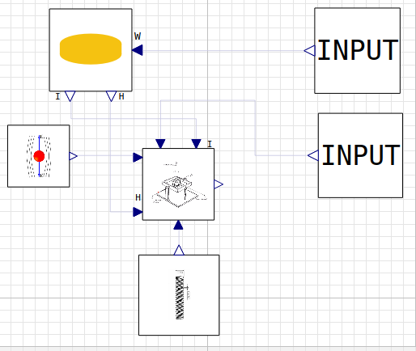

# **Gyroscopio de un grado de libertad** : Nutación

Módelo del ángulo de nutación de un gyroscopio de un solo grado de libertad.

---

## Descripción del proyecto
Para este proyecto hemos desarrollado el modelo de un sensor basado en el comportamiento de un giroscopio de un solo grado de libertad. Este tipo de dispositivo nos permite medir el angulo de entrada (Gamma) a partir del angulo del eje de salida.   

Para ello disponemos de la siguiente ecuación: 

$$ I*\alpha'' + Kv*\alpha' + Km*\alpha = H*\gamma'$$

donde el angulo de salida se representa con alpha y gamma prima la velocidad del angulo de entrada.

## Descripción de los modelos y componentes
Para llevar acabo la validación del modelo hemos desarrollado los siguientes elementos.

1. Paquetes (MYS.mo)\
Se ha creado un paquete para cargar todos los bloques, simulaciones y ejemplos de uso. 
En este paquete se pueden encontrar los siguientes bloques:
    - DiscBlock: Describe el comportamiento de un disco que gira sobre su eje. 

    - SensorBlock: Describe el comportamiento del sensor con un unico grado de libertad.

    - SpringBlock: Caracteriza el comportamiento del muelle.

    - AirBlock: Caracteriza el comportamiento del fluido.

    - inputBlock: Permite introducir valores.

Por otra parte disponemos de un ejemplo de sistema completo (Example_1.mo), el cual permite visualizar un diagram de bloques completo del sistema.
## Instalación y uso del modelo
Para la instalación y uso del paquete de bloques desarrollado se debe cargar el paquete MYS.mo y simular los test del paquete.

##  Requisitos de intalación
Para poder instalar el modelo se debe disponer de acceso al paquete MYS.mo y al software OMEdit.

